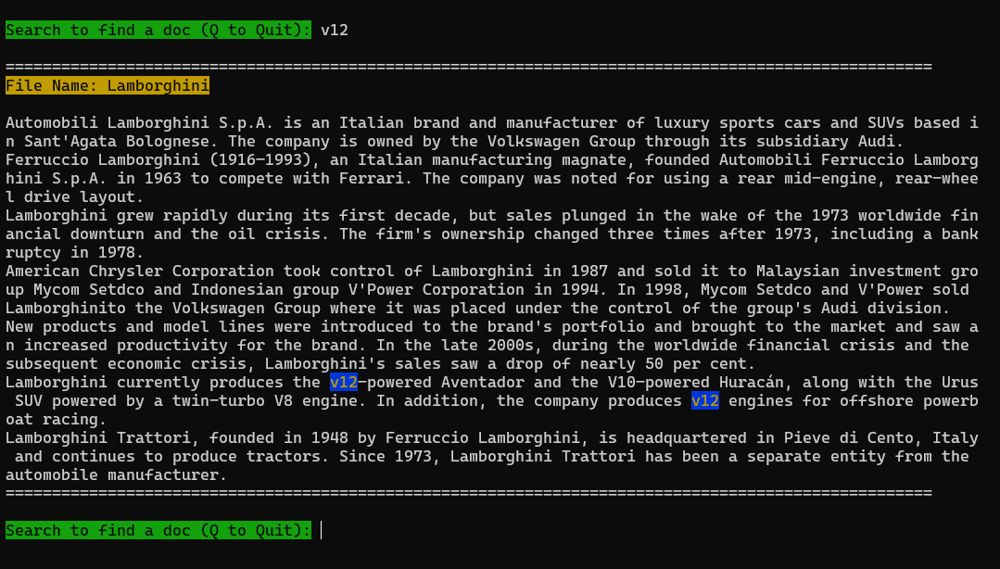

# Search Engine
A search engine that uses python data structures to store the data and search.



## Usage
### 1. Prepare the data
The data should be free text and in the `data/documents` folder. Every file in the `data/documents` folder will be indexed as a document.

### 2. Run the search engine
To run the script, first `cd` into the root directory of the project and then run the following command:
```bash
export PYTHONPATH=$(pwd)
```

Then run the following command:
```bash
python src/run.py
```

### 3. Search for a query
The search engine will ask you to enter a query. Enter the query and it will return the top 5 results.

## How it works
The search engine uses a few simple steps to search for a query:
1. It reads the data from the `data/documents` folder and stores it in a dictionary.
2. It preprocesses the data by removing stop words, punctuations and converting the text to lowercase.
3. It reads stopwords from the `data/stop_words.txt` file, preprocesses the stopwords and stores them in a set.
4. It reads the query from the user and preprocesses it.
5. It calculates the score of each document for the query and ranks them in descending order. The score is calculated by the number of times the document contains the query words.
6. It returns the top 5 results.